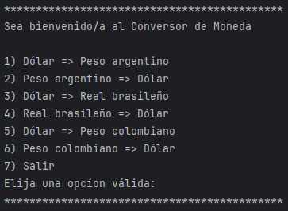
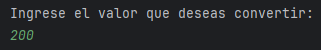
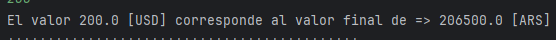

# Conversor de Monedas

Este proyecto es un software en Java que permite la conversion de unas divisas especificar utilizando una API externa. El software está diseñado para aceptar números por medio de la consola.

## Características

- Conversion de divisas especificas.
- Interfaz amigable y fácil de usar visualizado en consola.

## Tecnologías Utilizadas

- Java
- API Exchange Rate
- Gson
- Solicitudes HTTP

## Instalación

1. Clona el repositorio:

```
   git clone https://github.com/sebascasta14/challenge-currency-converter.git
```

2. Navega al directorio del proyecto:

```
   cd encrypt
```

3. Abre el proyecto en el IDE de preferencia.
4. Importa la dependencia Gson como archivo .jar
5. Coloca tu API Key como variable de entorno con el nombre:
```
   API_KEY=...
```
6. Ejecuta el programa.

## USO

1. Ingresa la opción de tu preferencia visualizada en el menu, en la consola de comandos.
2. Ingresa el valor de la divisa en la consola de comandos.

## Capturas de Pantalla






## Licencia

Este proyecto está bajo la Licencia MIT.

## Contacto

Para consultas o sugerencias, puedes contactarme en:

GitHub: [sebascasta14](https://github.com/sebascasta14)
LinkedIn: [Sebastian Castaneda](https://www.linkedin.com/in/sebastian-castaneda-27564b236/)